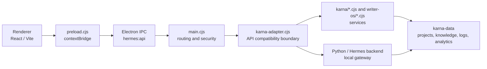

# Karna Desktop Runtime Architecture

## Overview
Karna Desktop 是基于 Electron 的桌面应用，由主进程、渲染进程和本地后端服务组成。

## Process Model

### Main Process (electron/main.cjs)
- 窗口管理、生命周期、IPC注册
- 本地HTTP服务器（karna-adapter.cjs）
- 文件系统访问、系统集成
- 自动更新、安装检查
- `deep-link-manager.cjs` 独立负责单实例锁、冷启动/二次启动 URL 和 Renderer 就绪队列；新链接使用 `karna://`，并保留 `hermes://` 兼容入口

### Renderer Process (src/)
- React + TypeScript + Vite
- 多个workshop视图（Writer/Soul/Agents/Connectors等）
- 通过preload.cjs暴露的karnaDesktop API与主进程通信

### Preload Bridge (electron/preload.cjs)
- contextBridge 安全暴露IPC方法
- api() 通用请求方法、selectPaths、revealPath等

### Local Backend
- karna-adapter.cjs: Express风格HTTP服务器
- karna/*.cjs: 模块化服务（storage、logs、skills、MCP、knowledge、writer-projects、Soul、API routes 等）
- karna/config-service.cjs: 桌面默认配置与配置 schema；每次调用返回隔离副本
- karna/connector-bridge.cjs: Connector API 到 `hermes_cli.connectors` 的 Python 进程边界；工作目录固定为仓库根目录
- writer-os/*.cjs: Writer OS 数据模型、检索、基准、交付等独立服务
- 数据存储: karna-data/ 目录（dev隔离）

## IPC Contract
- window.karnaDesktop.api({path, method, body}): 通用API调用
- window.karnaDesktop.selectPaths(options): 文件/目录选择
- window.karnaDesktop.revealPath(path): 在文件管理器中显示

## Data Directories
- Windows (dev): <project>/karna-data/
- Windows (packaged): %APPDATA%/Karna/karna-data/
- Writer projects: karna-data/writer-projects/
- Soul workshop: karna-data/soul-workshop/
- Knowledge base: `karna-data/vector-db/knowledge.sqlite`（旧 `knowledge_base.json` 仅用于一次性迁移兼容）
- MCP servers: karna-data/mcp_servers.json
- Logs: karna-data/logs/

## Module Registry
karna/ 目录下的模块通过工厂函数模式创建，接收 {fs, path, karnaPaths, storage} 等依赖注入。
